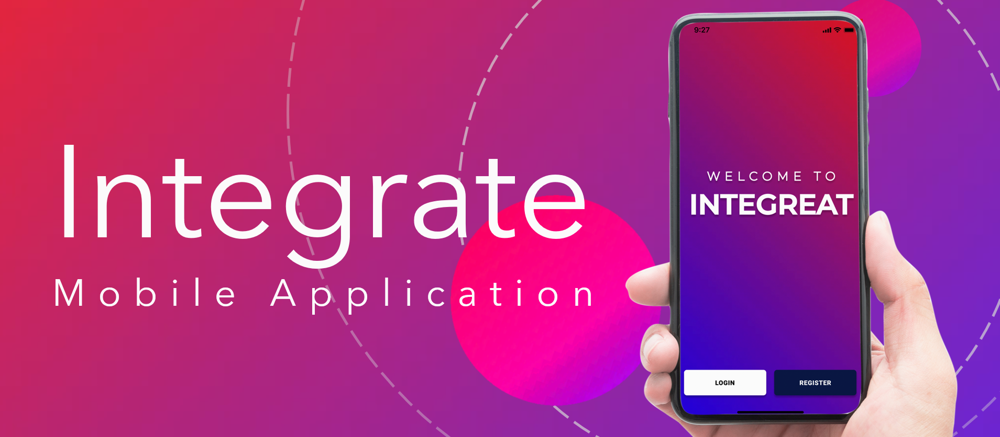
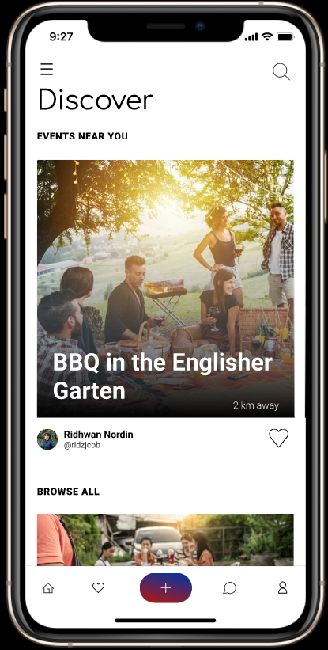
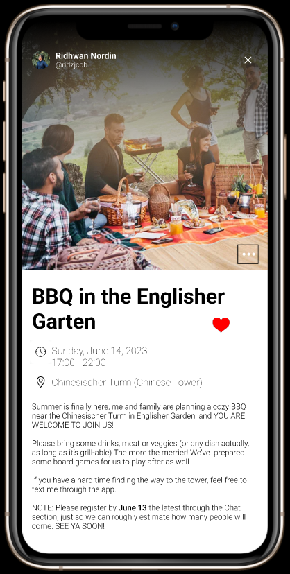
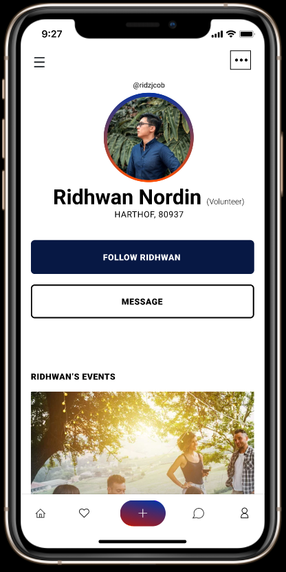
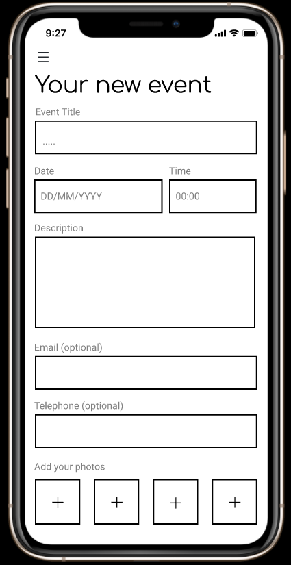
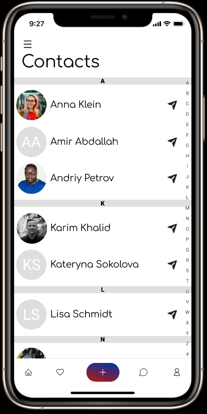
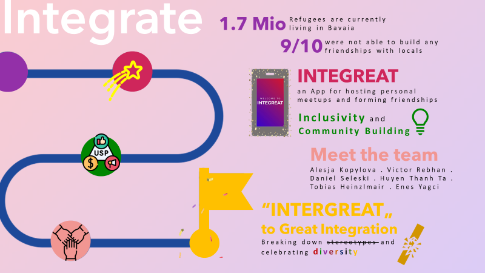

# Project Integrate 

# 🎯Our Vision
Welcome to the Bridging Communities project repository! This project aims to provide an innovative online platform designed to connect refugees with local Germans. The platform is purposed to facilitate integration through mutual idea exchange, event organization, and offering multiple networking opportunities. This README file serves as your guide for understanding the project's mission. At Integrate, we envision a world where no one is isolated or left behind due to language, cultural, or social barriers. Our mission is to empower refugees, providing them with the means to overcome communication barriers, expand their social networks, combat social isolation, and challenge prejudice.

# The Problem  
Refugees often face a plethora of challenges including communication barriers, limited social networks, social isolation, and prejudice. These barriers often limit their opportunities, potential, and quality of life.

# The Solution  
We offer Integrate, a platform that strives to bridge the gap between refugees and local Germans. Through our features like event discovery, event creation, user profiles, and more, we empower refugees to overcome their challenges and thrive. Our platform is designed to serve a diverse range of users. Whether you are a refugee struggling to integrate into a new society, an NGO worker trying to help refugees settle, or a local resident seeking to extend your social network and understanding of different cultures, Integrate is your go-to solution.

 

# Key Features  
🎫 Discover Events  
Explore all the events that others have organized.

📅 Create Your Events  
The platform empowers users to organize and advertise events designed to encourage interaction and collaboration between refugees and local Germans.

👤 User Profiles  
Users can create personalized profiles, showcasing their backgrounds, skills, and interests. This encourages connections based on shared passions or complementary abilities.

❤️ Liked/Saved Events  
Find all the events that you gave your “heart” to.

📱 Chat/Forum:   
Connect and start conversations with others.Chat/Forum: Connect and start conversations with others.

👥 Contact List  
Have a look through all the new friends that you’ve just made.

  

# 🚀 Getting Started
You are welcome to try [our prototype](https://www.figma.com/proto/QAGydlVljpiRFBgD3iVhPM/Group7---Entrepreneur?type=design&node-id=200-2154&scaling=scale-down&page-id=0%3A1&starting-point-node-id=200%3A876) for yourself. 

# 💬 Frequently Asked Questions
Frequently asked questions you can find [here.](https://github.com/Real-Projects-Digitalization/INTEGREAT/wiki/FAQs)

# 🌍 Our GitHub Page
You can access our GitHub page [here.](https://real-projects-digitalization.github.io/INTEGREAT/)  

# 🤝 Team  
Our project is brought to life by a dedicated team of visionaries and innovators:  

<table>
  <tr>
    <th> Name </th>
    <th> Surname </th>
    <th> Course of study </th>
    <th> University </th>
  </tr>
  <tr>
    <td> Alesja </td>
    <td> Kopylova </td>
    <td> Business Informatics </td>
    <td >University of Applied Sciences Munich </td>
  </tr>
  <tr>
    <td> Victor </td>
    <td> Rebhan </td>
    <td> Business Informatics </td>
    <td >University of Applied Sciences Munich </td>
  </tr>
  <tr>
    <td> Huyen </td>
    <td> Than Ta </td>
    <td> Business Informatics </td>
    <td >University of Applied Sciences Munich </td>
  </tr>
  <tr>
    <td> Tobias </td>
    <td> Heinzlmair </td>
    <td> Business Administration </td>
    <td >University of Applied Sciences Munich </td>
  </tr>
  <tr>
    <td> Daniel </td>
    <td> Selewski </td>
    <td> Business Informatics </td>
    <td >University of Applied Sciences Munich </td>
  </tr>
  <tr>
    <td> Enes </td>
    <td> Yagci </td>
    <td> Business Informatics </td>
    <td >University of Applied Sciences Munich </td>
  </tr>
</table>

# Thank you for being a part of our journey! Let's Integrate for a better world.

# 📚 Documentation
You can access our GitHub Wiki for detailed documentation [here.](https://github.com/Real-Projects-Digitalization/ss22-team-7-sose23/wiki)

